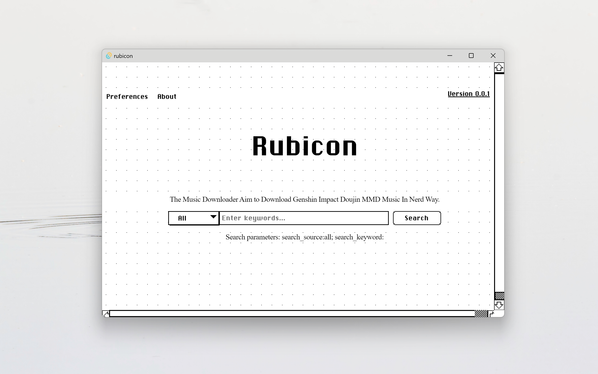

# Rubicon

Simple but not crude, get the Genshin Impact Doujin MMD Music search engine in _nerd way_ now [👉👉👉](https://github.com/rainbowflesh/Rubicon/releases).

## Preview



## WIP

### Server Side

- [ ] RESTful design
  - [ ] JSON data type
- [ ] Support mock data
- [ ] Searching:
  - [ ] q
  - [ ] kw
  - [ ] migu
  - [ ] MyFreeMP3
  - [ ] netease
- [ ] Downloading:
  - [ ] q
  - [ ] kw
  - [ ] migu
  - [ ] MyFreeMP3
  - [ ] netease
- [ ] Proxy

### Client Side

- [x] Design UI
  - [x] Main page
  - [x] Search box
  - [ ] Result card
  - [ ] Downloading
  - [ ] preferences
  - [ ] about
  - [ ] Vibrancy?
- [ ] Design LOGO
- [ ] Multiplatform
- [ ] Music player?

## Roadmap

1. 0.1.0: A functional music search engine, let you search music from several source.
2. 0.2.0: A functional music downloader, search'n download.
3. 0.3.0: Vibrancy.
4. 0.4.0: Single Page APP for docker deploy.
5. 0.5.0: Implement music player.
6. 0.6.0: Implement desktop lyrics.
7. 1.0.0: Implement all the functions that a music software should have.

## Usage

```shell
pnpm i
pnpm tauri dev
```

## Why rust

- [x] blAzInGly fASt
- [x] Safe
- [x] <del>Unnecessary Complex</del> Robust

## References

- https://sakofchit.github.io/system.css
- https://github.com/yt-dlp/yt-dlp/
